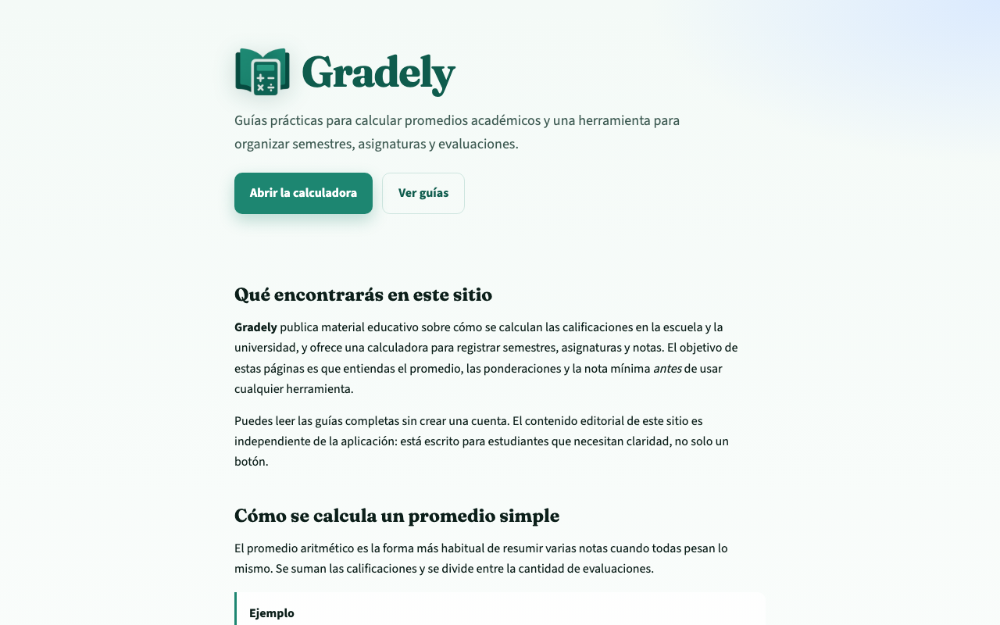
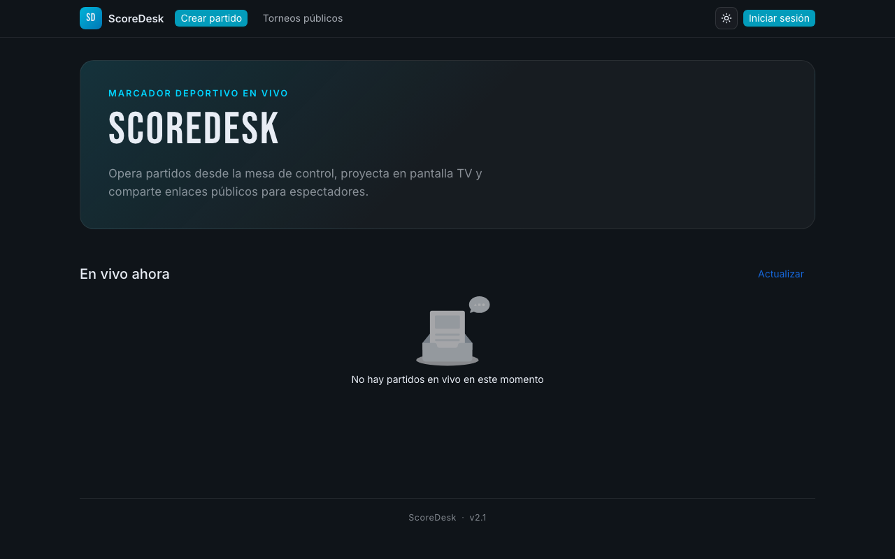
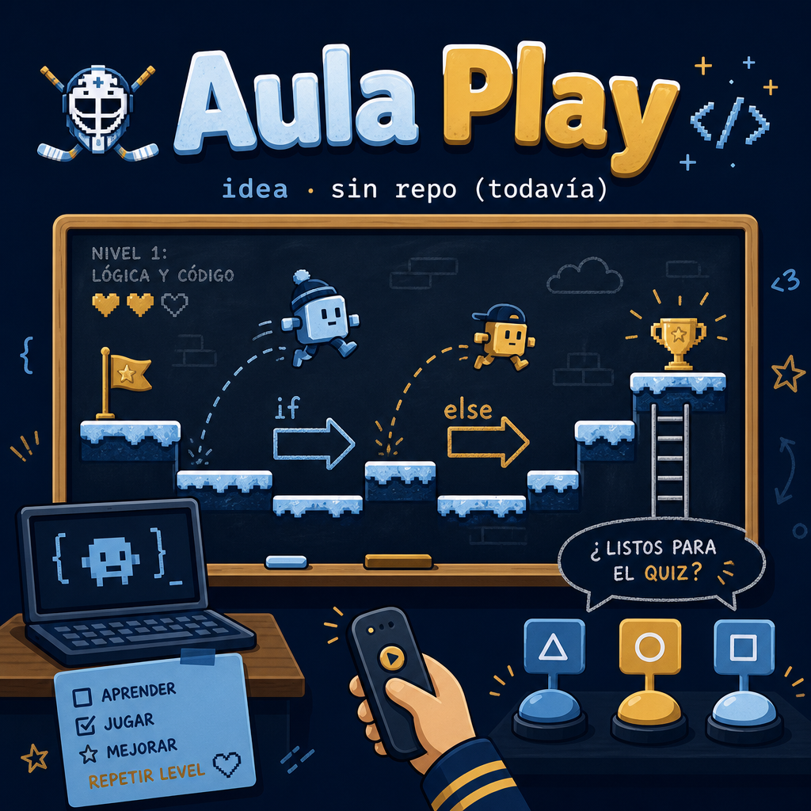

<!--
  Sube este archivo como README.md al repo MrBrightside19/MrBrightside19
  junto con las imágenes (misma carpeta):
  - github-banner-gabriel.png
  - mensuality-teaser.png
  - aulaplay-teaser.png
  - gradely-preview.png
  - scoredesk-preview.png
-->

<div align="center">


# Hola, soy Gabriel Fuentes Jeria

[](https://github.com/MrBrightside19)


**Mitad teclado, mitad silbato.**  
Si el código no corre, al menos el equipo sí.

[GitHub](https://github.com/MrBrightside19) · [Instagram — Coach Gabo](https://www.instagram.com/coach_.gabo/) · [Lobos Hockey](https://www.instagram.com/lobos_hockey/)

</div>

---

## Sobre mí (versión humana, no la del CV)

Soy **Gabriel**. De día (y de noche, seamos honestos) programo. El resto del tiempo estudio **Pedagogía en Educación Física** y entreno **patinaje y hockey** en [Lobos Hockey](https://www.instagram.com/lobos_hockey/). Sí: el mismo que te arma un marcador también te grita que no te quedes parado en la cancha.

No hago “soluciones enterprise para sinergias”. Hago cosas que alguien va a usar el lunes: calcular una nota, marcar un partido, cobrar la mensualidad sin llorar en un Excel.

Me muevo entre la pista y el editor a propósito. Un estudiante no quiere un tutorial de 40 minutos. Un tesorero de club no quiere un ERP. Y un entrenador no quiere una app que se cae cuando hay 2-1 en el tercer tiempo.

> “¿Se puede hacer en Flutter?”  
> — yo, siempre.  
> “¿Y si usamos Rust + Kubernetes + blockchain?”  
> — la IA, también siempre.  
> Spoiler: terminamos en Vue. O en Python. O en lo que haya dicho el chat a las 2 AM.

**Tres verdades incómodas**

- Construyo productos chicos, claros y listos para usarse (el resto es backlog eterno)
- Mezclo tecnología, educación y deporte porque si no, me aburro
- Aprendo haciendo: lo diseño, lo programo, lo publico… y después le pido a la IA que me explique por qué funciona

---

## Stack (el oficial y el que me impusieron)

**El que elijo yo:** Flutter, Vue y Python. Dart se cuela porque Flutter no viaja solo.

**El que la IA me “propone” con una sonrisa:** Next.js, TypeScript, PostgreSQL, un poquito de React y “¿y si lo pasamos a microservicios?”. A veces le hago caso. Mensuality es prueba de que a veces gana ella.

<div align="center">

### Lo que sí uso (de verdad)


### Lo que la IA me convenció de instalar “solo por esta vez”


<sub>Si la semana que viene aparece Go, no fue idea mía.</sub>

</div>

```text
while (hay_entrenamiento || hay_idea):
    if ia.sugiere("reescribir todo en Rust"):
        sonreir()
        seguir_con("Flutter | Vue | Python")
    else:
        construir_algo_que_sirva()
```

---

## Ahora mismo

| | |
|:--|:--|
| 🎓 | Cursando Pedagogía en Educación Física (el único del curso que discute con un linter) |
| 🏒 | Entrenando patinaje y hockey en Lobos |
| 💻 | Sacando productos del Excel y del “lo anoto en el grupo de WhatsApp” |
| 🤖 | Negociando con la IA para no migrar todo a un framework que salió ayer |
| ☕ | Debuggeando con café. O con un disco de hockey. Depende del día |

---

## Proyectos (los que sobrevivieron al “¿y si lo rehacemos?”)

Una selección de lo que he construido… y de lo que todavía vive en la cabeza (el hosting más barato para un MVP).


### [Gradely](https://gradely-app.netlify.app/)

<a href="https://gradely-app.netlify.app/">
  
</a>

Calculadora de notas y guías para estudiantes que ya no quieren hacer el promedio en la calculadora del celular (y equivocarse en el 40 %).

Organiza **semestres, asignaturas y evaluaciones**, calcula promedio simple o ponderado y te dice **qué nota necesitas para no repetir el ramo**. También hay guías de verdad, no solo un botón mágico.

Datos en el dispositivo. Versión web y Android. Stack de cabecera: el mío (**Flutter** / **Python**). La IA quiso meterle Firebase, GraphQL y un dragón. Dijimos que no.

[Sitio](https://gradely-app.netlify.app/)

</td>
<td width="50%" valign="top">

### [Scoredesk](https://mrbrightside19.github.io/scoreboard-sport/)

<a href="https://mrbrightside19.github.io/scoreboard-sport/">
  
</a>

Marcador en línea para hockey. Porque el marcador de palitos en la pizarra se borra con el guante, y esto no.

Goles, periodos y el drama del partido, desde el navegador. Nació en la cancha, no en un hackathon con pizzas frías. Hecho en **Vue**, publicado en GitHub Pages, listo para que el juez de mesa deje de buscar un lápiz.

[Demo](https://mrbrightside19.github.io/scoreboard-sport/) · [Código](https://github.com/MrBrightside19/scoreboard-sport)

</td>
</tr>
<tr>
<td width="50%" valign="top">

### Mensuality *(en desarrollo)*


Sistema de **cobranza y finanzas para clubes deportivos** en Chile (CLP). Traducción: sacar la tesorería del Excel antes de que el archivo se llame `cuotas_FINAL_v3_usar_este.xlsx`.

Panel de tesorería (transferencias, egresos, cuenta bancaria), **portal para apoderados y jugadores mayores** (¿estoy al día?, horarios, avisos) y correos de deuda y cumpleaños. Fichas, becas, facilidades. Club de verdad, no un CRUD disfrazado.

El enlace se publica cuando deje de estar “casi listo” (estado eterno de todo desarrollador).  
Stack de esta: Next.js, TypeScript y PostgreSQL. Sí, ganó la IA. No se lo recuerden mucho.

`Next.js` `TypeScript` `PostgreSQL` *(patrocinado por un prompt)*

</td>
<td width="50%" valign="top">

### Aula Play *(idea · aún sin repo)*



Plataforma para **aprender fundamentos de programación jugando**. Pensada para el colegio: variables, condicionales y bucles sin que la primera clase sea un `Hello World` en pizarra y un silencio incómodo.

Los profes también pueden armar **otros tópicos** y tirar cuestionarios al estilo Kahoot: historia, ciencias, educación física (sí, también eso) o lo que toque esa semana. Menos “abran el libro en la página 47”, más “el que responda primero se lleva el punto”.

Todavía no hay repositorio. Está en esa etapa honesta de “lo veo perfecto en la cabeza”. Cuando exista el repo, el enlace aparece acá. Hasta entonces, la IA ya sugirió Unity, Roblox y un metaverso. Vamos a intentar no hacer el metaverso.

`Flutter` `idea` `el-repo-se-crea-después`

---

## Números que GitHub insiste en mostrar

<div align="center">
  
  
</div>

<div align="center">
  
</div>

<sub>Si el lenguaje más usado no coincide con “Flutter, Vue y Python”, es que la IA volvió a colar un <code>package.json</code>.</sub>

---

## Contacto

<p align="center">
  <a href="https://github.com/MrBrightside19"></a>
  <a href="https://www.instagram.com/coach_.gabo/"></a>
  <a href="https://www.instagram.com/lobos_hockey/"></a>
</p>

Además del código, entreno **patinaje y hockey**. Horarios, categorías, apoderados, mensualidades y el marcador del partido no son “casos de uso”: son el martes a las 19:30.

Ahí nació Scoredesk. Ahí nació Mensuality. Gradely nació del otro yo: el estudiante que quiere saber si con un 4,0 se salva.

¿Proyecto, club, clase o “oye, la IA me dijo que usáramos Kubernetes”? Escríbeme. Prometo responder. No prometo no hacer un chiste.

<div align="center">

**Push a la pista. Commit al club. Merge cuando gane el partido.**

</div>
